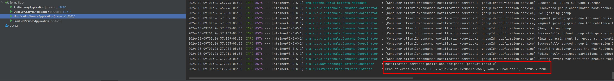

# README para el Sistema de Gestión de Inventarios de Productos

## Descripción del Reto

Este proyecto consiste en construir un sistema simple para gestionar inventarios de productos, permitiendo agregar, listar y actualizar productos. El sistema incluye un backend reactivo, un API Gateway, una cola de mensajería y un frontend desarrollado en Angular.

## Componentes del Sistema

1. **Backend 1 (Productos)**:
    - Encargado de la gestión de productos (agregar, listar, actualizar).
    - Implementa el patrón de diseño Repository para la gestión de datos.

2. **Backend 2 (Notificaciones)**:
    - Encargado de enviar notificaciones cuando un producto es agregado o actualizado.
    - Escucha mensajes de Kafka.

3. **API Gateway**:
    - Un único punto de entrada para el frontend que redirige las peticiones a los respectivos backends.

4. **Frontend (Angular)**:
    - Interfaz de usuario para gestionar el inventario de productos.

5. **Kafka**:
    - Cola de mensajería que permite la comunicación entre los dos backends.

    - PS C:\Windows\System32> cd C:\Kafka
    - PS C:\Kafka> .\bin\windows\zookeeper-server-start.bat .\config\zookeeper.properties

    - PS C:\Windows\System32> cd C:\Kafka
    - PS C:\Kafka> .\bin\windows\kafka-server-start.bat .\config\server.properties

## Estructura del Proyecto

El proyecto está estructurado como un proyecto Maven con los siguientes módulos:

- **discovery-server**: Servidor de descubrimiento basado en Eureka.
- **api-gateway**: Gateway API que redirige las solicitudes.
- **products-service**: Microservicio para la gestión de productos.
- **notification-service**: Microservicio para el envío de notificaciones.

### Pom Padre

```xml
<project xmlns="http://maven.apache.org/POM/4.0.0" xmlns:xsi="http://www.w3.org/2001/XMLSchema-instance"
         xsi:schemaLocation="http://maven.apache.org/POM/4.0.0 https://maven.apache.org/xsd/maven-4.0.0.xsd">
    <modelVersion>4.0.0</modelVersion>
    <parent>
        <groupId>org.springframework.boot</groupId>
        <artifactId>spring-boot-starter-parent</artifactId>
        <version>3.1.2</version>
        <relativePath/>
    </parent>
    <groupId>com.uncledavecode</groupId>
    <artifactId>microservices</artifactId>
    <version>1.0.0-SNAPSHOT</version>
    <packaging>pom</packaging>
    <properties>
        <spring-cloud.version>2022.0.3</spring-cloud.version>
        <maven.compiler.source>17</maven.compiler.source>
        <maven.compiler.target>17</maven.compiler.target>
        <project.build.sourceEncoding>UTF-8</project.build.source.encoding>
    </properties>
    <modules>
        <module>discovery-server</module>
        <module>api-gateway</module>
        <module>products-service</module>
        <module>notification-service</module>
    </modules>
    <dependencyManagement>
        <dependencies>
            <dependency>
                <groupId>org.springframework.cloud</groupId>
                <artifactId>spring-cloud-dependencies</artifactId>
                <version>${spring-cloud.version}</version>
                <type>pom</type>
                <scope>import</scope>
            </dependency>
        </dependencies>
    </dependencyManagement>
</project>
```

## Configuración y Ejecución

### Requisitos Previos

- Java 17
- Maven
- Docker (opcional, para ejecutar Kafka)
- MongoDB (ajustar según sea necesario)

### Instrucciones para la Ejecución

1. **Clonar el Repositorio**:
   Clona el repositorio en tu máquina local.

   ```bash
   git clone https://github.com/jerry-rodrigo/evalucion-intercorp
   cd <nombre-del-repositorio>
   ```

2. **Construir el Proyecto**:
   En la raíz del proyecto, ejecuta:

   ```bash
   mvn clean install
   ```

3. **Ejecutar Servicios**:
   Inicia cada uno de los servicios. Puedes hacerlo directamente desde la línea de comandos o utilizando Docker para Kafka.

    - **Discovery Server**:
      ```bash
      cd discovery-server
      mvn spring-boot:run
      ```

    - **API Gateway**:
      ```bash
      cd api-gateway
      mvn spring-boot:run
      ```

    - **Products Service**:
      ```bash
      cd products-service
      mvn spring-boot:run
      ```

    - **Notification Service**:
      ```bash
      cd notification-service
      mvn spring-boot:run
      ```

4. **Iniciar Kafka (opcional)**:
   Si estás usando Docker, puedes ejecutar Kafka y Zookeeper con el siguiente comando:

   ```bash
   docker-compose up
   ```

### Uso de la API

Aquí tienes ejemplos de cómo interactuar con la API usando `curl`.

#### Agregar un Producto (POST)

```bash
curl --location 'http://localhost:8080/api/product' \
--header 'Content-Type: application/json' \
--data '{
  "name": "Producto 1",
  "description": "Este es el producto 1",
  "price": 50.50,
  "status": true
}'
```

#### Actualizar un Producto (PUT)

```bash
curl --location --request PUT 'http://localhost:8080/api/product/670622410e9f9705b1c8e560' \
--header 'Content-Type: application/json' \
--data '{
  "name": "laptop Asus",
  "description": "Este es el producto 1",
  "price": 5550.50,
  "status": true
}'
```

#### Listar Productos (GET)

```bash
curl --location 'http://localhost:8080/api/product'
```




## Conclusión

Este sistema proporciona una solución para la gestión de inventarios de productos utilizando microservicios. Se pueden agregar, listar y actualizar productos, mientras que el servicio de notificaciones se encarga de enviar actualizaciones pertinentes a través de Kafka.
